# Overview
- pick up `YURI's face` from YURI's whole image (`YURI` is `Yuri Katsuki` on [Yuri!!! on ICE](http://yurionice.com/))
- use [`ruby-opencv`](https://github.com/ruby-opencv/ruby-opencv) which is an OpenCV wrapper for Ruby

# Prepare

## install ruby-opencv

```bash
$ gem install ruby-opencv
```

## collect Yuri's images
- by `Google Image Search`
- collect 10 images in this case
    - input_images/yuuri_[01-10].jpg

## classifier
- I used `Haar-like` classifier
    - `haarcascade_frontalface_alt.xml`

# exec script

```bash
$ ruby pick_up_yuri_face.rb
```

# output result
- You can gain Yuri's face images in `output_images/yuuri_[01-10]_face_region.jpg` as below

## from yuri_01.jpg (successful)

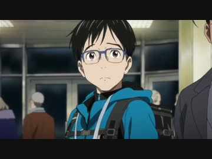

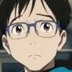

## from yuri_02.jpg (successful)

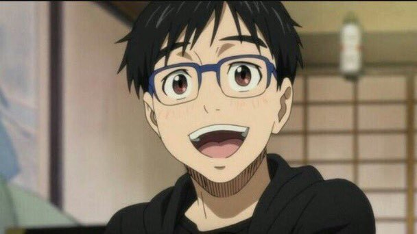

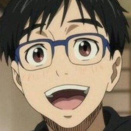

## from yuri_03.jpg (failed)

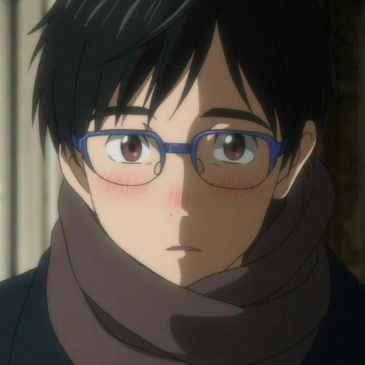


## from yuri_04.jpg (successful)

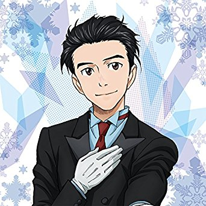


## from yuri_05.jpg (successful)

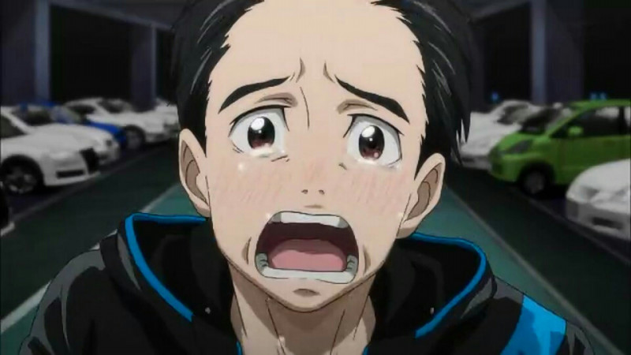

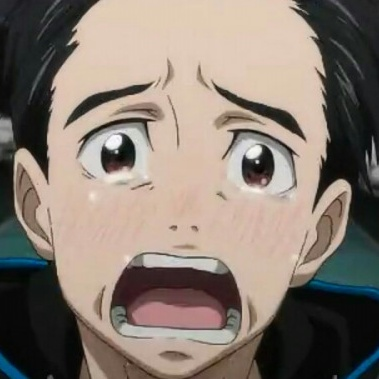

## from yuri_06.jpg (successful)

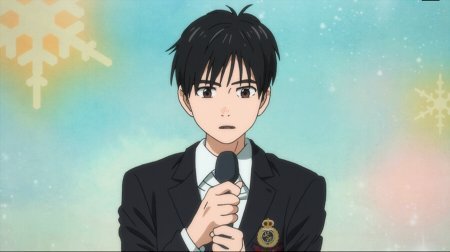

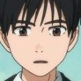

## from yuri_07.jpg (failed)

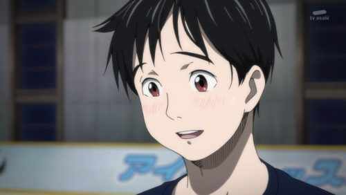


## from yuri_08.jpg (successful)

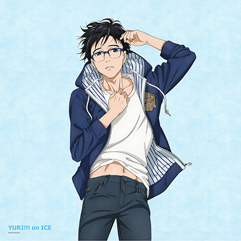


## from yuri_09.jpg (failed)

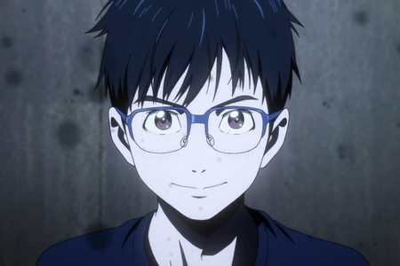

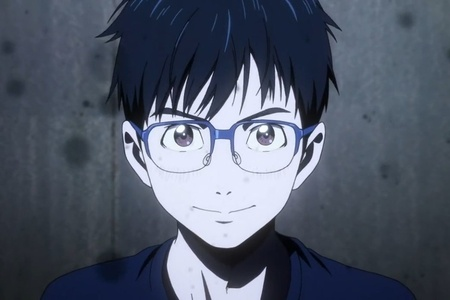

## from yuri_10.jpg (successful)

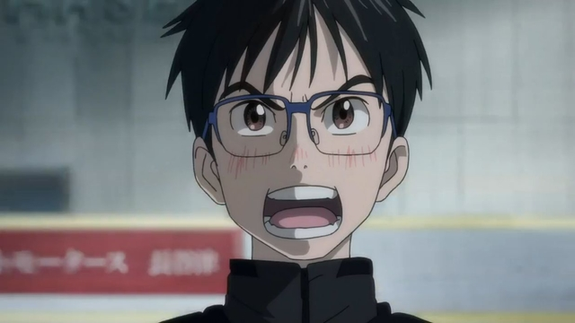

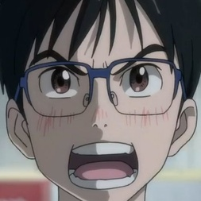

# note
- some images failed to be picked up
- I guess this is because classifier isn't suitable for anime graphic

# LICENSE
[MIT License](/LICENSE)
